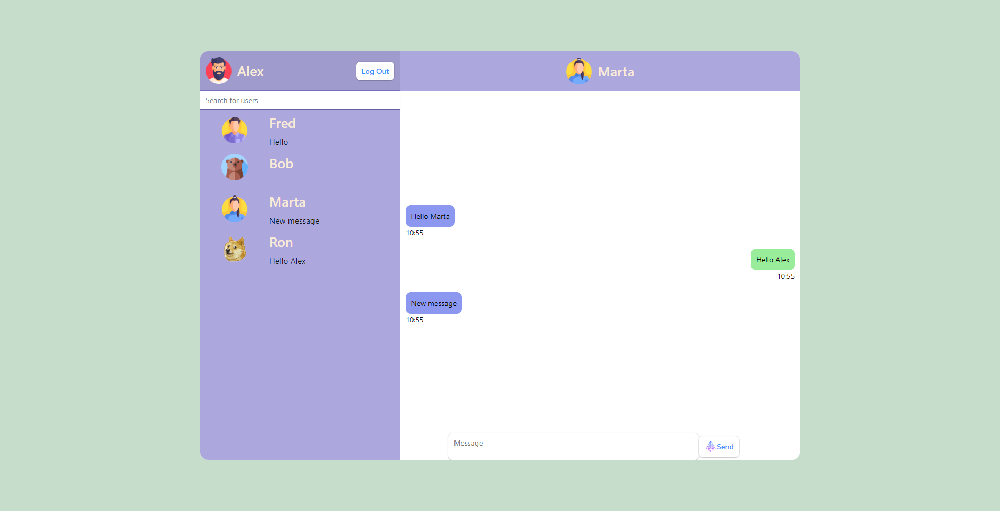

# Real time chat app

Project of simple real time chat application.


## Features

- Registration via email.
- Searching users and creating conversations.
- Real time updates


## Tech Stack

**Client:** React, React Router Dom 6, React Hook Form, Redux-Toolkit.

**Server:** Goggle Firebase


## Screenshots




## Run Locally

Clone the project

```bash
  git clone https://github.com/LordMalacath/chat-app
```

Go to the project directory

```bash
  cd chat-app
```

Install dependencies

```bash
  npm install
```

Start the server

```bash
  npm run start
```


## Environment Variables

To run this project, you will need to add the following environment variables to your .env file

`REACT_APP_FIREBASE_API_KEY`

`REACT_APP_FIREBASE_AUTH_DOMAIN`

`REACT_APP_FIREBASE_PROJECT_ID`

`REACT_APP_FIREBASE_STORAGE_BUCKET`

`REACT_APP_FIREBASE_MESSAGING_SENDER_ID`

`REACT_APP_FIREBASE_APP_ID`


## Authors

- [@LordMalacath](https://github.com/LordMalacath)


## License

[MIT](https://choosealicense.com/licenses/mit/)

